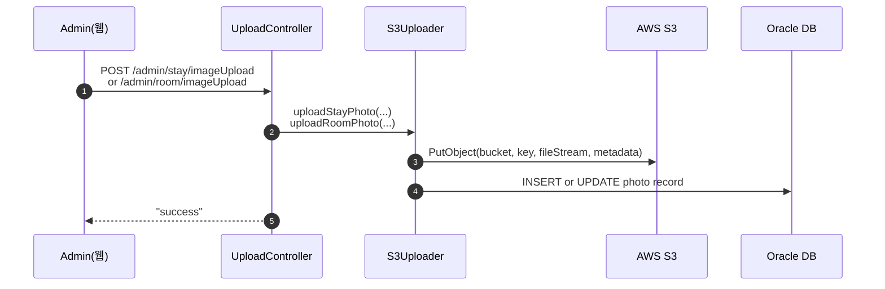

# STAYPOLIO 스타일 숙소 사이트 웹구현 프로젝트

<p align="center">
  
</p>


---

<br>

## 목차

- [개요]()

- [기술 스택]()

- [프로젝트 설계](https://github.com/Spring-team-Project2025/stay_folio_main)

- [핵심 기능]()

- [주요기능 실행화면]()

<br>

---

<br>

## 📌 프로젝트 개요

StayFolio 스타일의 **숙박 예약 웹 애플리케이션**으로,
**Spring MVC (레거시), MyBatis, JSP** 기반으로 개발되었으며 **Oracle Cloud DB와 AWS S3를 연동**했습니다.
숙소 검색부터 예약·결제까지 실제 서비스 가능한 수준의 기능을 구현하는 것을 목표로 했습니다.

또한 **Figma, Google Sheets를 활용해 초기 기획 단계부터 화면 설계, 데이터 구조 정의, 일정 관리**까지 전 과정을 경험하며  
기획 → 설계 → 개발 → 테스트 → 배포로 이어지는 **프로젝트 라이프사이클 전체를 수행**했습니다.

🔗 기획 자료  
- [Figma 화면 설계]((https://www.figma.com/design/FYYxvzwGzkNBLJrTOa5ROW/Stay-folio?node-id=0-1&t=ekM1qKT06YyBd0Pw-1))  
- [Google Sheets 데이터 구조/일정 관리]([https://docs.google.com/spreadsheets/...](https://docs.google.com/spreadsheets/d/1OQmVgNTZ_Yc10W1KOM3R84FSjb7fj2WZQVZQrMFWXYk/edit?usp=sharing))

- 개발 기간 : 25/07/23 ~ 25/08/20

<br>

---

<br>

## 🎯 프로젝트 목표
- **실무 수준 웹 서비스 구현**
  - Spring MVC + MyBatis + JSP 기반 아키텍처 설계 및 구현  
  - Controller – Service – Mapper – DB 계층 구조 확립  
  - Oracle Cloud DB 기반 정규화, 제약조건, 외래키를 반영한 테이블 설계  

- **핵심 기능 제공**

  **👑 관리자(Admin)**
  - 관리자 대시보드 (예약 통계, 숙소 통계, 베스트 숙소 TOP5)  
  - 숙소/객실 등록 · 수정 · 삭제 (숙소 정보, 객실 이미지, 편의시설/어메니티 관리)  

  **🙋 사용자(User)**
  - 숙소 검색 및 상세 페이지 (지역, 추천, 날짜, 인원 필터 적용)  
  - 예약 기능 (체크인/체크아웃, 인원 기반 가용 여부 확인, 결제 모듈 연동)  
  - 마이페이지 (회원 정보 수정, 예약 내역/취소 내역, 북마크 관리)   

- **보안 및 인증**
  - Spring Security 기반 회원/관리자 권한 분리  
  - 비밀번호 암호화 (BCrypt), 세션/Principal 인증 관리  

- **클라우드 및 인프라 활용**
  - Oracle Cloud Wallet을 통한 보안 DB 연결  
  - AWS S3 이미지 업로드 및 IAM 권한 설정  
  - 실제 배포 환경을 고려한 스토리지 아키텍처 구축  

- **UX/UI 개선**
  - StayFolio 스타일 벤치마킹 → 심플하고 감각적인 화면 디자인  
  - Kakao Map API 연동 → 숙소 위치 표시  
  - 반응형 웹 적용 (데스크탑/모바일 최적화)  

- **협업 및 관리**
  - GitHub 브랜치 전략 기반 협업, 코드 리뷰, 병합 관리  
  - 역할 분담을 통한 DB·백엔드·프론트·클라우드 전 영역 경험  
  - 로그 분석·디버깅·리팩토링을 통한 실무 수준 문제 해결 역량 강화  

<br>

---

<br>

## 🔧 기술 스택

- **Backend**: `Java`, `Spring MVC (Legacy)`, `MyBatis`  
- **Frontend**: `JSP`, `HTML5`, `CSS3`, `JavaScript (jQuery)`, `Figma`(기획/UI 설계)  
- **Database**: `Oracle Cloud DB` (SQL, 시퀀스, 제약조건, 정규화), `Google Sheets`(ERD/데이터 구조 설계)  
- **Infra/Cloud**: `AWS S3` (이미지 업로드, IAM 권한), `Oracle Wallet`  
- **Security**: `Spring Security`, `BCryptPasswordEncoder`  
- **Tools**: `GitHub`, `SourceTree`, `STS`, `Google Sheets`, `Figma`

<br>

---

<br>

## 👾 프로젝트 설계, 구현 

- 📂 Figma 설계 : <[https://www.figma.com/...](https://www.figma.com/design/FYYxvzwGzkNBLJrTOa5ROW/Stay-folio?node-id=0-1&t=ekM1qKT06YyBd0Pw-1)>

- 📂 Google Sheets 기획 : <[https://docs.google.com/...](https://docs.google.com/spreadsheets/d/1OQmVgNTZ_Yc10W1KOM3R84FSjb7fj2WZQVZQrMFWXYk/edit?usp=sharing)>

- 📂 Team Github : <https://github.com/Spring-team-Project2025/stay_folio_main>

- 📂 Diagram : <https://spring-team-project2025.github.io/stay_folio_documents/>

<p align="center">
  
</p>

<p align="center">
  
</p>

<br>

---

<br>

## 💻 핵심 기능

### 👑 관리자(Admin)

#### 1️⃣ 관리자 대시보드
> **예약 통계, 숙소 통계, 베스트 숙소 TOP5 제공**  
관리자가 전체 현황을 한눈에 파악할 수 있는 대시보드 화면을 구현했습니다.

<p align="center">  </p>

<br>

#### 2️⃣ 숙소/객실 이미지 업로드 (AWS S3 연동)

| 이미지 등록 화면 | 이미지 등록 완료 화면 |
|----------------|------------------|
|  |  |


> **숙소/객실 이미지 업로드·수정**을 AWS S3에 저장하고, 업로드된 경로를 DB에 반영합니다.  
> 업로드 키는 `stay/{siId}/{riId?}/{UUID}` 규칙으로 관리되어 충돌 없이 안전하게 저장됩니다.

<br>

##### 🔁 동작 흐름


##### 📌 설명

- `Admin(웹)` : 관리자 페이지에서 이미지 선택 후 업로드 요청 전송

- `UploadController` : 업로드 요청을 받아 `S3Uploader` 서비스에 전달

- `S3Uploader(Service)` : S3에 실제 업로드 수행 후 DB 반영

- `AWS S3` : 이미지 파일 저장소 **(UUID 기반 키 관리)**

- `Oracle DB` : 업로드된 파일 경로(sp_url)를 테이블에 INSERT/UPDATE

<br>

##### 🧱 핵심 코드

###### 🌐 AWS 연결 설정
```java
// AwsConfig.java
@Configuration
@PropertySource("classpath:application.properties")
public class AwsConfig {
    //S3와 통신하기 위한 AmazonS3 Bean을 생성

    @Value("${cloud.aws.credentials.access-key}") private String accessKey;
    @Value("${cloud.aws.credentials.secret-key}") private String secretKey;
    @Value("${cloud.aws.region.static}") private String region;

    @Bean
    public AmazonS3 amazonS3() {
        // AWS 인증 정보 생성
        BasicAWSCredentials credentials = new BasicAWSCredentials(accessKey, secretKey);

        // AmazonS3 클라이언트 생성 및 반환
        return AmazonS3ClientBuilder.standard()
            .withRegion(Regions.fromName(region))
            .withCredentials(new AWSStaticCredentialsProvider(credentials))
            .build();
    }
}
```

##### 📌 설명

- AWS S3 접근을 위한 _AmazonS3 Bean_ 등록
- application.properties에 저장된 액세스 키 / 시크릿 키 / 리전 정보를 불러와 인증

#### (1) 업로드 (등록)
```java
// UploadController.java
@PostMapping("/stay/imageUpload")
public String uploadStayImages(@RequestParam("siId") int siId,
      @RequestParam(value = "riId", required = false) Integer riId,
			@RequestParam("imageFiles") List<MultipartFile> imageFiles,
      @RequestParam("spIdxes") List<Integer> spIdxes) throws IOException {

    for (int i = 0; i < imageFiles.size(); i++) {
			MultipartFile file = imageFiles.get(i);
			int spIdx = spIdxes.get(i);

			if (!file.isEmpty()) {
				s3Uploader.uploadStayPhoto(siId, riId, spIdx, file);
			}
		}
    return "success";
}
```

##### 📌 설명

- 다중 파일 업로드를 처리하는 컨트롤러
- S3Uploader 서비스에 업로드 작업 위임

<br>

```java
// S3Uploader.java (등록)
public void uploadStayPhoto(int siId, Integer riId, int spIdx, MultipartFile file) throws IOException {
    String fileName = "stay/" + siId + "/" + UUID.randomUUID();

    ObjectMetadata metadata = new ObjectMetadata();
	metadata.setContentType(file.getContentType());
	metadata.setContentDisposition("inline");
	metadata.setContentLength(file.getSize());

    PutObjectRequest request = new PutObjectRequest(bucket, fileName, file.getInputStream(), metadata);
	amazonS3.putObject(request); // S3에 업로드

    PhotoVO photo = new PhotoVO();
	photo.setSiId(siId);
	photo.setRiId(riId);
	photo.setSpIdx(spIdx);
	photo.setSpUrl(fileName);

	stayMapper.insertStayPhoto(photo);
}
```
##### 📌 설명

- UUID를 사용해 파일명을 고유하게 생성
- S3에 업로드 후, 파일 경로(sp_url)를 DB에 INSERT

<br>

```java
<!-- StayMapper.xml -->
<insert id="insertStayPhoto" parameterType="com.hotel.domain.PhotoVO">
  INSERT INTO t_stay_photo (si_id, ri_id, sp_idx, sp_url)
  VALUES (#{siId}, #{riId, jdbcType=NULL}, #{spIdx}, #{spUrl})
</insert>
```

##### 📌 설명

- 업로드된 이미지 정보를 t_stay_photo 테이블에 저장

<br>

#### (2) 업로드 (수정)
```java
// S3Uploader.java (수정)
public void updateStayImage(int siId, Integer riId, int spIdx, MultipartFile file) throws IOException {
    String key = "stay/" + siId + "/" + UUID.randomUUID();

    ObjectMetadata meta = new ObjectMetadata();
    meta.setContentType(file.getContentType());
    meta.setContentLength(file.getSize());

    amazonS3.putObject(new PutObjectRequest(bucket, key, file.getInputStream(), meta));

    PhotoVO photo = new PhotoVO();
    photo.setSiId(siId); photo.setRiId(riId);
    photo.setSpIdx(spIdx); photo.setSpUrl(key);

    if (stayMapper.existsStayPhoto(photo)) {
        stayMapper.updateStayPhoto(photo); // UPDATE
    } else {
        stayMapper.insertStayPhoto(photo); // INSERT
    }
}
```
##### 📌 설명

- 기존 spIdx 위치에 이미지가 있으면 UPDATE
- 없으면 새 레코드를 INSERT

<br>

```java
<!-- StayMapper.xml -->
<select id="existsStayPhoto" parameterType="com.hotel.domain.PhotoVO" resultType="boolean">
  SELECT CASE WHEN COUNT(*) > 0 THEN 1 ELSE 0 END
  FROM t_stay_photo
  WHERE si_id = #{siId} AND sp_idx = #{spIdx}
    <choose>
      <when test="riId == null">AND ri_id IS NULL</when>
      <otherwise>AND ri_id = #{riId}</otherwise>
    </choose>
</select>

<update id="updateStayPhoto" parameterType="com.hotel.domain.PhotoVO">
  UPDATE t_stay_photo
  SET sp_url = #{spUrl}
  WHERE si_id = #{siId} AND sp_idx = #{spIdx}
    <choose>
      <when test="riId == null">AND ri_id IS NULL</when>
      <otherwise>AND ri_id = #{riId}</otherwise>
    </choose>
</update>
```

##### 📌 설명

- existsStayPhoto로 이미지 존재 여부 체크
- 있으면 updateStayPhoto, 없으면 insertStayPhoto 수행

<br>

---

<br>

## 🖼 주요 기능 실행화면


