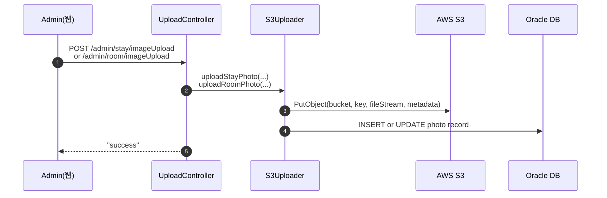
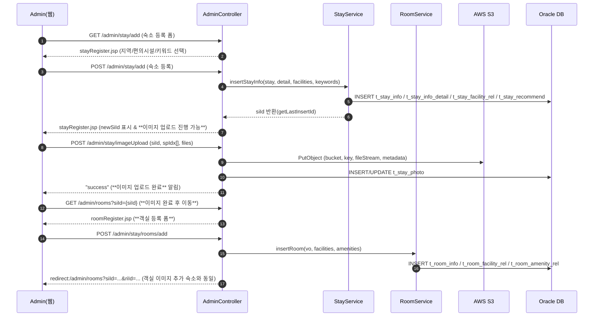
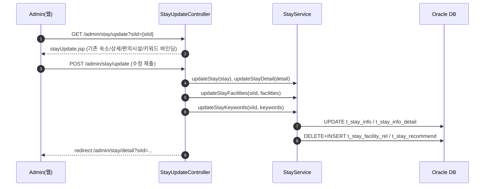
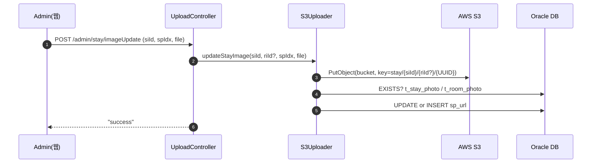
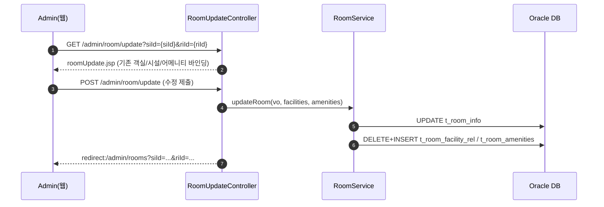

# STAYPOLIO 스타일 숙소 사이트 웹구현 프로젝트

<p align="center">
  
</p>


---

<br>

## 목차

- [개요]()

- [기술 스택]()

- [프로젝트 설계](https://github.com/Spring-team-Project2025/stay_folio_main)

- [핵심 기능]()

- [주요기능 실행화면]()

<br>

---

<br>

## 📌 프로젝트 개요

StayFolio 스타일의 **숙박 예약 웹 애플리케이션**으로,
**Spring MVC (레거시), MyBatis, JSP** 기반으로 개발되었으며 **Oracle Cloud DB와 AWS S3를 연동**했습니다.
숙소 검색부터 예약·결제까지 실제 서비스 가능한 수준의 기능을 구현하는 것을 목표로 했습니다.

또한 **Figma, Google Sheets를 활용해 초기 기획 단계부터 화면 설계, 데이터 구조 정의, 일정 관리**까지 전 과정을 경험하며  
기획 → 설계 → 개발 → 테스트 → 배포로 이어지는 **프로젝트 라이프사이클 전체를 수행**했습니다.

🔗 기획 자료  
- [Figma 화면 설계](https://www.figma.com/design/FYYxvzwGzkNBLJrTOa5ROW/Stay-folio?node-id=0-1&t=ekM1qKT06YyBd0Pw-1)  
- [Google Sheets 데이터 구조/일정 관리](https://docs.google.com/spreadsheets/d/1OQmVgNTZ_Yc10W1KOM3R84FSjb7fj2WZQVZQrMFWXYk/edit?usp=sharing)

- 개발 기간 : 25/07/23 ~ 25/08/20

<br>

---

<br>

## 🎯 프로젝트 목표
- **실무 수준 웹 서비스 구현**
  - Spring MVC + MyBatis + JSP 기반 아키텍처 설계 및 구현  
  - Controller – Service – Mapper – DB 계층 구조 확립  
  - Oracle Cloud DB 기반 정규화, 제약조건, 외래키를 반영한 테이블 설계  

- **핵심 기능 제공**

  **👑 관리자(Admin)**
  - 관리자 대시보드 (예약 통계, 숙소 통계, 베스트 숙소 TOP5)  
  - 숙소/객실 등록 · 수정 · 삭제 (숙소 정보, 객실 이미지, 편의시설/어메니티 관리)
  - 회원 조회 · 관리
  - 예약 조회 · 관리

  **🙋 사용자(User)**
  - 숙소 검색 및 상세 페이지 (지역, 추천, 날짜, 인원 필터 적용)  
  - 예약 기능 (체크인/체크아웃, 인원 기반 가용 여부 확인, 결제 모듈 연동)
  - 회원가입/로그인 (Spring Security)
  - 마이페이지 (회원 정보 수정, 예약 내역/취소 내역, 북마크 관리)   

- **보안 및 인증**
  - Spring Security 기반 회원/관리자 권한 분리  
  - 비밀번호 암호화 (BCrypt), 세션/Principal 인증 관리  

- **클라우드 및 인프라 활용**
  - Oracle Cloud Wallet을 통한 보안 DB 연결  
  - AWS S3 이미지 업로드 및 IAM 권한 설정  
  - 실제 배포 환경을 고려한 스토리지 아키텍처 구축  

- **UX/UI 개선**
  - StayFolio 스타일 벤치마킹 → 심플하고 감각적인 화면 디자인  
  - Kakao Map API 연동 → 숙소 위치 표시  
  - 반응형 웹 적용 (데스크탑/모바일 최적화)  

- **협업 및 관리**
  - GitHub 브랜치 전략 기반 협업, 코드 리뷰, 병합 관리  
  - 역할 분담을 통한 DB·백엔드·프론트·클라우드 전 영역 경험  
  - 로그 분석·디버깅·리팩토링을 통한 실무 수준 문제 해결 역량 강화  

<br>

---

<br>

## 🔧 기술 스택

- **Backend**: `Java`, `Spring MVC (Legacy)`, `MyBatis`  
- **Frontend**: `JSP`, `HTML5`, `CSS3`, `JavaScript (jQuery)`, `Figma`(기획/UI 설계)  
- **Database**: `Oracle Cloud DB` (SQL, 시퀀스, 제약조건, 정규화), `Google Sheets`(ERD/데이터 구조 설계)  
- **Infra/Cloud**: `AWS S3` (이미지 업로드, IAM 권한), `Oracle Wallet`  
- **Security**: `Spring Security`, `BCryptPasswordEncoder`  
- **Tools**: `GitHub`, `SourceTree`, `STS`, `Google Sheets`, `Figma`

<br>

---

<br>

## 👾 프로젝트 설계, 구현 

- 📂 Figma 설계 : <[https://www.figma.com/...](https://www.figma.com/design/FYYxvzwGzkNBLJrTOa5ROW/Stay-folio?node-id=0-1&t=ekM1qKT06YyBd0Pw-1)>

- 📂 Google Sheets 기획 : <[https://docs.google.com/...](https://docs.google.com/spreadsheets/d/1OQmVgNTZ_Yc10W1KOM3R84FSjb7fj2WZQVZQrMFWXYk/edit?usp=sharing)>

- 📂 Team Github : <https://github.com/Spring-team-Project2025/stay_folio_main>

- 📂 Diagram : <https://spring-team-project2025.github.io/stay_folio_documents/>

<p align="center">
  
</p>

<p align="center">
  
</p>

<br>

---

<br>

## 💻 핵심 기능

### 👑 관리자(Admin)

### 1️⃣ 관리자 대시보드 (Chart.js 시각화)
> **예약/회원/지역 지표를 서버에서 집계해 JSP에서 Chart.js로 시각화**

<p align="center">  </p>

https://github.com/user-attachments/assets/0f5893e5-7e0a-46d0-963d-b936e676c879

- 관리자가 전체 현황을 한눈에 파악할 수 있는 대시보드 화면을 구현하기 위해 서버에서 통계를 집계한 후 JSP에서 Chart.js로 시각화했습니다.
- 서버에서 가공한 통계를 JSP에서 JSTL로 안전하게 출력하여 차트를 구성했습니다.
- 집계 지표: 총 예약 / 진행 / 완료 / 취소  
- 회원 vs 비회원 예약 비율  
- 지역별 숙소 등록 현황  

##### 🧱 핵심 코드

###### 🧩 Controller (요약)
```java
// AdminDashController.java
@GetMapping("/dashboard")
public String DashBoard(Model model) {
	// 예약 현황 (총 예약 건수, 진행 중, 완료, 취소)
	ReservationStatsDTO stats = adminService.getReservationStats();
	// 회원, 비회원 예약 비율
	Map<String, Integer> memberRatio = adminService.getMemberVsGuestRatio();
	// 지역 별 숙소 현황
	List<LocationCategoryVO> regionStats = adminService.getStayCountByRegion();

	return "admin/adminDash";
}
```

###### 📊 adminDash.jsp (요약)
```java
<div class="admin-content"
	style="margin-top: 40px; margin-bottom: 40px">
	<div class="chart-grid">
		<!-- 예약 현황 -->
		<div class="chart-box">
			<h2 style="margin-bottom: 16px">예약 현황</h2>
			<canvas id="reservationChart" width="300" height="280"></canvas>
		</div>
		<!-- 예약 비율 -->
		<div class="chart-box">
			<h3 style="margin-bottom: 16px">회원 vs 비회원 예약 비율</h3>
			<canvas id="memberGuestChart" width="250" height="250"></canvas>
		</div>
		<!-- 지역별 숙소 등록 -->
		<div class="chart-box">
			<h2 style="margin-bottom: 16px">지역별 숙소 등록 현황</h2>
			<canvas id="regionChart" width="300" height="280"></canvas>
		</div>
	</div>
</div>
```
<details>
	<summary><b>Script(Chart.js) (자세히 보기)</b></summary>
	
	<script>
      document.addEventListener("DOMContentLoaded", function () {

        // 예약 현황 (null-safe)
        const total = ${stats.totalCount != null ? stats.totalCount : 0};
        const inProgress = ${stats.inProgressCount != null ? stats.inProgressCount : 0};
        const completed = ${stats.completedCount != null ? stats.completedCount : 0};
        const canceled = ${stats.canceledCount != null ? stats.canceledCount : 0};

        new Chart(document.getElementById("reservationChart"), {
          type: "bar",
          data: {
            labels: ["총 예약", "진행 중", "완료", "취소"],
            datasets: [{
              label: "건수",
              backgroundColor: ["#bbbbbb", "#888888", "#555555", "#dddddd"],
              data: [total, inProgress, completed, canceled]
            }]
          },
          options: {
            responsive: true,
            title: { display: true, text: "예약 현황 통계" },
            legend: { display: false },
            scales: {
              yAxes: [{ ticks: { beginAtZero: true, precision: 0 } }]
            }
          }
        });

        // 회원/비회원
        const member = ${memberCount != null ? memberCount : 0};
        const guest = ${guestCount != null ? guestCount : 0};

        console.log("member : ", member, "guest : ", guest);

        new Chart(document.getElementById("memberGuestChart"), {
          type: "doughnut",
          data: {
            labels: ["회원", "비회원"],
            datasets: [{
              data: [member, guest],
              backgroundColor: ["#ccc", "#000"]
            }]
          },
          options: {
            responsive: true,
            legend: { position: "bottom" }
          }
        });

        // 지역별 숙소
        const regionLabels = [
          <c:forEach var="region" items="${regionStats}" varStatus="loop">
            "${region.lcName}"<c:if test="${!loop.last}">,</c:if>
          </c:forEach>
        ];
        const regionData = [
          <c:forEach var="region" items="${regionStats}" varStatus="loop">
            ${region.count}<c:if test="${!loop.last}">,</c:if>
          </c:forEach>
        ];

        new Chart(document.getElementById("regionChart"), {
          type: "bar",
          data: {
            labels: regionLabels,
            datasets: [{
              label: "숙소 개수",
              backgroundColor: "#aaaaaa",
              data: regionData
            }]
          },
          options: {
            responsive: true,
            title: { display: true, text: "지역별 숙소 등록 통계" },
            legend: { display: false },
            scales: {
              yAxes: [{ ticks: { beginAtZero: true, precision: 0 } }]
            }
          }
        });

      });
    </script>
</details>

<details> 
	<summary><b>Service & Mapper (자세히 보기)</b></summary> 

	// AdminServiceImpl.java
 	@Override
	public ReservationStatsDTO getReservationStats() {
    	return adminMapper.getReservationStats();
	}
	@Override
	public int getMemberReservationCount() {
    	return adminMapper.getMemberReservationCount();
	}
	@Override
	public int getGuestReservationCount() {
    	return adminMapper.getGuestReservationCount();
	}
	@Override
	public List<LocationCategoryVO> getRegionStayStats() {
    	return adminMapper.getRegionStayStats();
	}

	// AdminMapper.xml
	<!-- 예약 현황 그래프 -->
	<select id="getReservationStats"
		resultType="com.hotel.domain.ReservationStatsDTO">
	<![CDATA[
		SELECT
			COUNT(*) AS totalCount,
			COUNT(CASE WHEN sr_status = 'a' AND sr_checkout > SYSDATE THEN 1 END) AS inProgressCount,
			COUNT(CASE WHEN sr_status = 'a' AND sr_checkout <= SYSDATE THEN 1 END) AS completedCount,
			COUNT(CASE WHEN sr_status = 'c' THEN 1 END) AS canceledCount
		FROM t_stay_reservation
		WHERE sr_status IN ('a', 'c')
	]]>
	</select>

	<!-- 회원, 비회원 예약 비율 -->
	<select id="getMemberVsGuestRatio" resultType="map">
		SELECT
		COUNT(CASE
		WHEN mi_id IS NOT NULL THEN 1 END) AS memberCount,
		COUNT(CASE WHEN
		mi_id IS NULL THEN 1 END) AS guestCount
		FROM t_stay_reservation
		WHERE
		sr_status = 'a' -- 예약 완료된 건만
	</select>

	<!-- 지역 별 숙소 현황 그래프 -->
	<select id="getStayCountByRegion"
		resultType="com.hotel.domain.LocationCategoryVO">
		SELECT
		l.lc_id AS lcId,
		l.lc_name AS lcName,
		COUNT(s.si_id) AS
		count
		FROM
		t_location_category l
		LEFT JOIN
		t_stay_info s ON l.lc_id =
		s.lc_id AND s.si_show = '1'
		GROUP BY
		l.lc_id, l.lc_name
		ORDER BY
		l.lc_id
	</select>
 
 </details>
<br>
<br>

### 2️⃣ 숙소/객실 이미지 업로드 (AWS S3 연동)

> **숙소/객실 이미지 업로드·수정**을 AWS S3에 저장하고, 업로드된 경로를 DB에 반영합니다.  
> 업로드 키는 `stay/{siId}/{riId?}/{UUID}` 규칙으로 관리되어 충돌 없이 안전하게 저장됩니다.

<p align="center">
  <table>
    <tr>
      <th style="text-align:center;">이미지 등록 화면</th>
      <th style="text-align:center;">이미지 등록 완료 화면</th>
    </tr>
    <tr>
      <td align="center">
        
      </td>
      <td align="center">
        
      </td>
    </tr>
  </table>
</p>


<br>

##### 🔁 동작 흐름


##### 📌 설명

- `Admin(웹)` : 관리자 페이지에서 이미지 선택 후 업로드 요청 전송

- `UploadController` : 업로드 요청을 받아 `S3Uploader` 서비스에 전달

- `S3Uploader(Service)` : S3에 실제 업로드 수행 후 DB 반영

- `AWS S3` : 이미지 파일 저장소 **(UUID 기반 키 관리)**

- `Oracle DB` : 업로드된 파일 경로(sp_url)를 테이블에 INSERT/UPDATE

<br>

##### 🧱 핵심 코드

###### 🌐 AWS 연결 설정
```java
// AwsConfig.java
@Configuration
@PropertySource("classpath:application.properties")
public class AwsConfig {
    //S3와 통신하기 위한 AmazonS3 Bean을 생성

    @Value("${cloud.aws.credentials.access-key}") private String accessKey;
    @Value("${cloud.aws.credentials.secret-key}") private String secretKey;
    @Value("${cloud.aws.region.static}") private String region;

    @Bean
    public AmazonS3 amazonS3() {
        // AWS 인증 정보 생성
        BasicAWSCredentials credentials = new BasicAWSCredentials(accessKey, secretKey);

        // AmazonS3 클라이언트 생성 및 반환
        return AmazonS3ClientBuilder.standard()
            .withRegion(Regions.fromName(region))
            .withCredentials(new AWSStaticCredentialsProvider(credentials))
            .build();
    }
}
```

##### 📌 설명

- AWS S3 접근을 위한 _AmazonS3 Bean_ 등록
- application.properties에 저장된 액세스 키 / 시크릿 키 / 리전 정보를 불러와 인증
  
<br>


#### (1) 업로드 (등록)
###### 🧩 Controller (요약)
```java
// UploadController.java
@PostMapping("/stay/imageUpload")
public String uploadStayImages(@RequestParam("siId") int siId,
      @RequestParam(value = "riId", required = false) Integer riId,
			@RequestParam("imageFiles") List<MultipartFile> imageFiles,
      @RequestParam("spIdxes") List<Integer> spIdxes) throws IOException {

    for (int i = 0; i < imageFiles.size(); i++) {
			MultipartFile file = imageFiles.get(i);
			int spIdx = spIdxes.get(i);

			if (!file.isEmpty()) {
				s3Uploader.uploadStayPhoto(siId, riId, spIdx, file);
			}
		}
    return "success";
}
```

##### 📌 설명

- 다중 파일 업로드를 처리하는 컨트롤러
- S3Uploader 서비스에 업로드 작업 위임

<br>

```java
// S3Uploader.java (등록)
public void uploadStayPhoto(int siId, Integer riId, int spIdx, MultipartFile file) throws IOException {
    String fileName = "stay/" + siId + "/" + UUID.randomUUID();

    ObjectMetadata metadata = new ObjectMetadata();
	metadata.setContentType(file.getContentType());
	metadata.setContentDisposition("inline");
	metadata.setContentLength(file.getSize());

    PutObjectRequest request = new PutObjectRequest(bucket, fileName, file.getInputStream(), metadata);
	amazonS3.putObject(request); // S3에 업로드

    PhotoVO photo = new PhotoVO();
	photo.setSiId(siId);
	photo.setRiId(riId);
	photo.setSpIdx(spIdx);
	photo.setSpUrl(fileName);

	stayMapper.insertStayPhoto(photo);
}
```
##### 📌 설명

- UUID를 사용해 파일명을 고유하게 생성
- S3에 업로드 후, 파일 경로(sp_url)를 DB에 INSERT

<br>

```java
<!-- StayMapper.xml -->
<insert id="insertStayPhoto" parameterType="com.hotel.domain.PhotoVO">
  INSERT INTO t_stay_photo (si_id, ri_id, sp_idx, sp_url)
  VALUES (#{siId}, #{riId, jdbcType=NULL}, #{spIdx}, #{spUrl})
</insert>
```

##### 📌 설명

- 업로드된 이미지 정보를 t_stay_photo 테이블에 저장

<br>

#### (2) 업로드 (수정)

<p align="center">  </p>

```java
// S3Uploader.java (수정)
public void updateStayImage(int siId, Integer riId, int spIdx, MultipartFile file) throws IOException {
    String key = "stay/" + siId + "/" + UUID.randomUUID();

    ObjectMetadata meta = new ObjectMetadata();
    meta.setContentType(file.getContentType());
    meta.setContentLength(file.getSize());

    amazonS3.putObject(new PutObjectRequest(bucket, key, file.getInputStream(), meta));

    PhotoVO photo = new PhotoVO();
    photo.setSiId(siId); photo.setRiId(riId);
    photo.setSpIdx(spIdx); photo.setSpUrl(key);

    if (stayMapper.existsStayPhoto(photo)) {
        stayMapper.updateStayPhoto(photo); // UPDATE
    } else {
        stayMapper.insertStayPhoto(photo); // INSERT
    }
}
```

<details>
	<summary><b>Service & Mapper (자세히 보기)</b></summary>

 	// S3Uploader.java
 	// 숙소 이미지 수정
	public void updateStayImage(int siId, Integer riId, int spIdx, MultipartFile file) throws IOException {
		String fileName = "stay/" + siId + "/" + UUID.randomUUID();
		ObjectMetadata metadata = new ObjectMetadata();
		metadata.setContentType(file.getContentType());
		metadata.setContentDisposition("inline");
		metadata.setContentLength(file.getSize());

		PutObjectRequest request = new PutObjectRequest(bucket, fileName, file.getInputStream(), metadata);
		amazonS3.putObject(request); // S3에 업로드

		PhotoVO photo = new PhotoVO();
		photo.setSiId(siId);
		photo.setRiId(riId);
		photo.setSpIdx(spIdx);
		photo.setSpUrl(fileName);

		System.out.println("PhotoVO riId: " + photo.getRiId());

		boolean exists = stayMapper.existsStayPhoto(photo); // 이미지 존재 여부 확인

		System.out.println("이미지 존재 여부: " + stayMapper.existsStayPhoto(photo));

		if (exists) {
			stayMapper.updateStayPhoto(photo); // UPDATE
		} else {
			stayMapper.insertStayPhoto(photo); // 비어있을 경우 INSERT
		}
	}

	// 객실 이미지 수정
	public void updateRoomImage(int siId, int riId, int spIdx, MultipartFile file) throws IOException {
		String fileName = "stay/" + siId + "/" + riId + "/" + UUID.randomUUID();
		ObjectMetadata metadata = new ObjectMetadata();
		metadata.setContentType(file.getContentType());
		metadata.setContentDisposition("inline");
		metadata.setContentLength(file.getSize());

		PutObjectRequest request = new PutObjectRequest(bucket, fileName, file.getInputStream(), metadata);
		amazonS3.putObject(request); // S3에 업로드

		RoomPhotoVO photo = new RoomPhotoVO();
		photo.setSiId(siId);
		photo.setRiId(riId);
		photo.setSpIdx(spIdx);
		photo.setSpUrl(fileName);

		boolean exists = roomMapper.existsRoomPhoto(photo); // 이미지 존재 여부 확인

		if (exists) {
			roomMapper.updateRoomPhoto(photo); // UPDATE
		} else {
			roomMapper.insertRoomPhoto(photo); // 비어있을 경우 INSERT
		}
	}

 	<!-- StayMapper.xml -->
  	<insert id="insertStayPhoto" parameterType="com.hotel.domain.PhotoVO">
  		INSERT INTO t_stay_photo (si_id, ri_id, sp_idx, sp_url)
  		VALUES (#{siId}, #{riId, jdbcType=NULL}, #{spIdx}, #{spUrl})
	</insert>
	
 	<select id="existsStayPhoto" parameterType="com.hotel.domain.PhotoVO" resultType="boolean">
  		SELECT CASE WHEN COUNT(*) > 0 THEN 1 ELSE 0 END
  		FROM t_stay_photo
  		WHERE si_id = #{siId} AND sp_idx = #{spIdx}
    	<choose>
      		<when test="riId == null">AND ri_id IS NULL</when>
      		<otherwise>AND ri_id = #{riId}</otherwise>
    	</choose>
	</select>

	<update id="updateStayPhoto" parameterType="com.hotel.domain.PhotoVO">
  		UPDATE t_stay_photo
  		SET sp_url = #{spUrl}
  		WHERE si_id = #{siId} AND sp_idx = #{spIdx}
    	<choose>
      		<when test="riId == null">AND ri_id IS NULL</when>
      		<otherwise>AND ri_id = #{riId}</otherwise>
    	</choose>
	</update>
 
</details>

##### 📌 설명

- 기존 spIdx 위치에 이미지가 있으면 UPDATE
- 없으면 새 레코드를 INSERT
- existsStayPhoto로 이미지 존재 여부 체크
- 있으면 updateStayPhoto, 없으면 insertStayPhoto 수행


<br>
<br>

### 3️⃣ 숙소 + 객실 등록 (폼 → 검증/저장 → 다음 단계)

<p align="center">
  <table>
    <tr>
      <th style="text-align:center;">숙소 등록 화면</th>
      <th style="text-align:center;">숙소 등록 요구 모달</th>
    </tr>
    <tr>
      <td align="center">
		  
      </td>
      <td align="center">
		
      </td>
    </tr>
  </table>
</p>

https://github.com/user-attachments/assets/ffee1a38-0baa-4da0-9752-4d8f830fdf26

> **숙소 기본정보/상세/편의시설/키워드 등록 → 즉시 객실 등록 화면으로 이동**  
> 폼 제출 후 마지막 `siId`를 바인딩해 **연속 등록(숙소 → 객실 → 이미지)** 흐름을 지원합니다.

<br>

#### 🔁 동작 흐름


##### 📌 설명
- Admin(웹) : 관리자에서 숙소 등록 → 이미지 등록 → 객실 등록까지 순차 진행

- AdminController : 숙소 등록 폼 제공, 등록 요청 처리, StayService/RoomService 호출

- StayService : 숙소 기본정보·상세·편의시설·키워드를 DB에 저장, 마지막 siId 반환

- AWS S3 : 업로드된 이미지 파일 저장 (key: stay/{siId}/{riId?}/{UUID})

- Oracle DB : t_stay_info, t_stay_detail, t_stay_photo, t_room_info 등 INSERT/UPDATE

- RoomService : 객실 정보와 선택된 편의시설·어메니티를 DB에 등록

- 흐름 제약 : 반드시 이미지 등록을 완료해야만 객실 등록(roomRegister.jsp)으로 이동 가능

<br>

##### 🧱 핵심 코드
###### 🧩 Controller (요약)
```java
	// AdminContriller.java
	// 숙소 등록
	@PostMapping("/stay/add")
	public String addStay(StayVO stay, StayDetailVO detail,
			@RequestParam(value = "facilities", required = false) List<Integer> facilities, @RequestParam(value = "keyword", required = false) List<Integer> keyword, Model model) {

		// 숙소 정보 insert
		stayService.insertStayInfo(stay, detail, facilities, keyword);

		// 최근 si_id 가져오기
		int siId = stayService.getLastInsertId();

		if (facilities == null) {
			facilities = new ArrayList<>();
		}

		List<FacilityVO> facilityList = stayService.getAllFacilities();

		model.addAttribute("stay", stay); // 숙소 기본 정보
		model.addAttribute("detail", detail); // 숙소 상세 정보
		model.addAttribute("facilityList", facilityList); // 모든 편의 시설 목록
		model.addAttribute("selectedFacilityIds", facilities); // 선택된 편의 시설
		model.addAttribute("newSiId", siId); // insert 된 숙소 id

		return "/admin/room/stayRegister"; // 같은 페이지로 돌아가서 이미지 등록 진행
	}
```
###### 🧩 Service (요약)
```java
	// StayServiceImpl.java
	// admin - 숙소 등록
	@Override
	@Transactional(rollbackFor = Exception.class)
	public void insertStayInfo(StayVO stay, StayDetailVO detail, List<Integer> facilityIds, List<Integer> keyword) {
		// 숙소 기본 정보
		stayMapper.insertStayInfo(stay);

		// 등록된 숙소 id
		int siId = stayMapper.getLastInsertId();

		// 상세 정보 id에 등록된 숙소 id 설정
		detail.setSiId(siId);
		// 숙소 상세 정보 등록
		stayMapper.insertStayDetail(detail);

		// 선택된 편의시설 등록
		if (facilityIds != null) {
			for (Integer fiId : facilityIds) {
				stayMapper.insertFacilityRel(siId, fiId);
			}
		}

		// 선택된 키워드 등록
		if (keyword != null) {
			for (Integer rcId : keyword) {
				adminMapper.insertCategoryStay(rcId, siId);
			}
		}
	}
```

<details> 
	<summary><b>Controller (자세히 보기)</b></summary> 

	@Controller
	@RequestMapping("/admin")
	public class AdminController {

		@Autowired
		private StayService stayService;

		@Autowired
		private RoomService roomService;

		@Autowired
		private AdminService adminService;

		// 숙소 등록 페이지
		@GetMapping("/stay/add")
		public String StayForm(Model model) {
			// 지역 선택 목록
			model.addAttribute("locationList", stayService.getAllLocations());
		
			// 편의 시설 선택 목록
			model.addAttribute("facilityList", stayService.getAllFacilities());

			// 검색 키워드 선택 목록
			model.addAttribute("keywordList", adminService.getRecommendKeyword());

			return "admin/room/stayRegister";
		}

		// 숙소 등록
		@PostMapping("/stay/add")
		public String addStay(StayVO stay, StayDetailVO detail,
			@RequestParam(value = "facilities", required = false) List<Integer> facilities, @RequestParam(value = "keyword", required = false) List<Integer> keyword, Model model) {

			// 숙소 정보 insert
			stayService.insertStayInfo(stay, detail, facilities, keyword);

			// 최근 si_id 가져오기
			int siId = stayService.getLastInsertId();

			if (facilities == null) {
				facilities = new ArrayList<>();
			}

			List<FacilityVO> facilityList = stayService.getAllFacilities();

			model.addAttribute("stay", stay); // 숙소 기본 정보
			model.addAttribute("detail", detail); // 숙소 상세 정보
			model.addAttribute("facilityList", facilityList); // 모든 편의 시설 목록
			model.addAttribute("selectedFacilityIds", facilities); // 선택된 편의 시설
			model.addAttribute("newSiId", siId); // insert 된 숙소 id

			return "/admin/room/stayRegister"; // 같은 페이지로 돌아가서 이미지 등록 진행
		}
	

		@GetMapping("/rooms") // 숙소 등록에서 객실 등록 페이지 이동
		public String showRoomRegister(@RequestParam("siId") int siId,
			@RequestParam(value = "riId", required = false) Integer riId, Model model) {
			model.addAttribute("siId", siId);
			model.addAttribute("riId", riId);
			model.addAttribute("facilityList", stayService.getAllFacilities());
			model.addAttribute("amenityList", roomService.getAllAmenities());
		
			// 객실 번호가 있을 경우
        	if (riId != null) {
            	RoomVO room = roomService.getRoomById(siId, riId);
            	List<FacilityVO> roomFacilities = roomService.getFacilitiesByRoomId(siId, riId);
            	List<AmenityVO> roomAmenities = roomService.getAmenitiesByRoomId(siId, riId);
            
            	// 선택된 시설들의 fiId, aiIdx만 추출
            	List<Integer> selectedFacilityIds = roomFacilities.stream().map(FacilityVO::getFiId)
                    .collect(Collectors.toList());
            	List<Integer> selectedAmenityIds = roomAmenities.stream().map(AmenityVO::getAiIdx)
                    .collect(Collectors.toList());
            
             	Map<Integer, Boolean> selectedFacilityMap = selectedFacilityIds.stream()
                     .collect(Collectors.toMap(i -> i, i -> true, (a,b)->a));
             	Map<Integer, Boolean> selectedAmenityMap = selectedAmenityIds.stream()
                     .collect(Collectors.toMap(i -> i, i -> true, (a,b)->a));
            
           	 	model.addAttribute("room", room);
            	model.addAttribute("selectedFacilityMap", selectedFacilityMap);
            	model.addAttribute("selectedAmenityMap", selectedAmenityMap);
        	}
		
			return "admin/room/roomRegister";
		}

		@PostMapping("/stay/rooms/add") // 객실 등록
		public String addRoom(RoomVO vo, @RequestParam(value = "facilities", required = false) List<Integer> facilities,
			@RequestParam(value = "amenities", required = false) List<Integer> amenities, RedirectAttributes rttr) {

			int riId = roomService.insertRoom(vo, facilities, amenities);

			// 등록 된 객실, 숙소 마지막 id
			rttr.addAttribute("siId", vo.getSiId());
			rttr.addAttribute("riId", riId);

			return "redirect:/admin/rooms";
		}

		// 등록 완료된 객실 리스트 출력
		@GetMapping(value = "/stay/rooms/list", produces = "application/json")
		@ResponseBody
		public List<RoomVO> getRoomList(@RequestParam("siId") int siId) {
			return stayService.getRoomsByStayId(siId);
		}
	}
</details>

<details> 
	<summary><b>숙소 등록 Service & Mapper (자세히 보기)</b></summary> 

 	// StayServiceImpl.java (등록 부분 발췌)
	// 편의시설 리스트
	@Override
	public List<FacilityVO> getAllFacilities() {
		return stayMapper.getAllFacilities();
	}

	// admin - 숙소 등록
	@Override
	@Transactional(rollbackFor = Exception.class)
	public void insertStayInfo(StayVO stay, StayDetailVO detail, List<Integer> facilityIds, List<Integer> keyword) {
		// 숙소 기본 정보
		stayMapper.insertStayInfo(stay);

		// 등록된 숙소 id
		int siId = stayMapper.getLastInsertId();

		// 상세 정보 id에 등록된 숙소 id 설정
		detail.setSiId(siId);
		// 숙소 상세 정보 등록
		stayMapper.insertStayDetail(detail);

		// 선택된 편의시설 등록
		if (facilityIds != null) {
			for (Integer fiId : facilityIds) {
				stayMapper.insertFacilityRel(siId, fiId);
			}
		}

		// 선택된 키워드 등록
		if (keyword != null) {
			for (Integer rcId : keyword) {
				adminMapper.insertCategoryStay(rcId, siId);
			}
		}
	}

	// 숙소 마지막 id 조회
	@Override
	public int getLastInsertId() {
		return stayMapper.getLastInsertId();
	}

	@Override
	public void insertStayDetail(StayDetailVO detail) {
		stayMapper.insertStayDetail(detail);
	}

	@Override
	public void insertFacilityRel(int siId, int fiId) {
		stayMapper.insertFacilityRel(siId, fiId);
	}

	// StayMapper.xml (등록 부분 발췌)
 	<!-- admin insert 시작 -->
	<!-- 지역 목록 조회 -->
	<select id="getAllLocations"
		resultType="com.hotel.domain.LocationCategoryVO">
		SELECT lc_id AS lcId, lc_name AS lcName, lc_id AS lcId
		FROM
		t_location_category ORDER BY lc_id
	</select>

	<!-- 편의시설 목록 조회 -->
	<select id="getAllFacilities"
		resultType="com.hotel.domain.FacilityVO">
		SELECT fi_id AS fiId, fi_name AS fiName FROM
		t_facility_info ORDER BY fi_id
	</select>

	<!-- 숙소 기본 정보 등록 -->
	<insert id="insertStayInfo"
		parameterType="com.hotel.domain.StayVO">
		INSERT INTO t_stay_info (
		si_name, si_desc, si_loca,
		lc_id,
		si_book, si_review, si_minperson, si_maxperson, si_minprice,
		si_extra, si_peak, si_off, si_discount,
		si_show, si_delete, si_date
		)
		VALUES (
		#{siName}, #{siDesc}, #{siLoca}, #{lcId},
		#{siBook},
		#{siReview}, #{siMinperson}, #{siMaxperson}, #{siMinprice},
		#{siExtra}, #{siPeak}, #{siOff}, #{siDiscount},
		#{siShow},
		#{siDelete},
		SYSDATE
		)
	</insert>

	<!-- 가장 최근 siId -->
	<select id="getLastInsertId" resultType="int">
		SELECT MAX(si_id) FROM
		t_stay_info
	</select>

	<!-- 숙소 상세 설명 등록 -->
	<insert id="insertStayDetail"
		parameterType="com.hotel.domain.StayDetailVO">
		INSERT INTO t_stay_info_detail (
		si_id, si_notice,
		si_desc1, si_desc2, si_feat1, si_feat2,
		si_feat_title1, si_feat_title2,
		si_address, si_addrdesc, si_phone, si_email, si_instagram,
		si_bizname,
		si_biznum, si_ceo,
		si_pet, si_parking, si_food, si_checkin, si_checkout
		) VALUES (
		#{siId}, #{siNotice, jdbcType=VARCHAR}, #{siDesc1},
		#{siDesc2}, #{siFeat1}, #{siFeat2},
		#{siFeatTitle1},
		#{siFeatTitle2},
		#{siAddress}, #{siAddrdesc}, #{siPhone},
		#{siEmail}, #{siInstagram},
		#{siBizname}, #{siBiznum}, #{siCeo},
		#{siPet}, #{siParking}, #{siFood},
		#{siCheckin}, #{siCheckout}
		)
	</insert>


	<!-- 숙소-편의시설 매핑 등록 -->
	<insert id="insertFacilityRel">
		INSERT INTO t_stay_facility_rel (si_id, fi_id)
		VALUES
		(#{siId}, #{fiId})
	</insert>

	<!-- 이미지 insert -->
	<insert id="insertStayPhoto"
		parameterType="com.hotel.domain.PhotoVO">
		INSERT INTO t_stay_photo (si_id, ri_id, sp_idx, sp_url)
		VALUES (#{siId}, #{riId, jdbcType=NULL}, #{spIdx}, #{spUrl})
	</insert>

	<!-- admin insert 끝 -->
</details>

<details> 
	<summary><b>객실 등록 Service & Mapper (자세히 보기)</b></summary> 

	// RoomServiceImpl.java (등록 부분 발췌)
 	// admin - 객실 등록
	@Override
	public int insertRoom(RoomVO vo, List<Integer> facilities, List<Integer> amenities) {
		// 객실 기본 정보 등록
		roomMapper.insertRoom(vo);

		int riId = vo.getRiId();
		int siId = vo.getSiId();

		// 객실 편의시설 insert
		if (facilities != null) {
			for (Integer fiId : facilities) {
				roomMapper.insertRoomFacility(siId, riId, fiId);
			}
		}

		// 객실 어메니티 insert
		if (amenities != null) {
			for (Integer aiIdx : amenities) {
				roomMapper.insertRoomAmenity(siId, riId, aiIdx);
			}
		}

		return riId;
	}

	// RoomMapper.xml (등록 부분 발췌)
 	<!-- admin 객실 등록 -->
	<insert id="insertRoom" parameterType="com.hotel.domain.RoomVO">
		<!-- siId에서 riId 최대값+1 조회 -->
		<selectKey keyProperty="riId" resultType="int"
			order="BEFORE">
			SELECT NVL(MAX(ri_id), 0) + 1
			FROM t_room_info
			WHERE si_id =
			#{siId}
		</selectKey>

		INSERT INTO t_room_info (
		si_id, ri_id, ri_type, ri_name, ri_desc,
		ri_person,
		ri_maxperson,
		ri_area, ri_bed, ri_bedcnt,
		ri_price,
		ri_bedroom,
		ri_bathroom, ri_show,
		ri_delete, ri_date
		) VALUES (
		#{siId},
		#{riId}, #{riType},
		#{riName}, #{riDesc},
		#{riPerson},
		#{riMaxperson},
		#{riArea}, #{riBed},
		#{riBedcnt},
		#{riPrice},
		#{riBedroom},
		#{riBathroom}, #{riShow},
		#{riDelete},
		SYSDATE
		)
	</insert>

	<insert id="insertRoomFacility">
		INSERT INTO t_room_facility_rel (si_id, ri_id, fi_id)
		VALUES (#{siId}, #{riId}, #{fiId})
	</insert>

	<insert id="insertRoomAmenity">
		INSERT INTO t_room_amenities (si_id, ri_id, ai_idx)
		VALUES (#{siId}, #{riId}, #{aiIdx, jdbcType=INTEGER})
	</insert>

	<insert id="insertRoomPhoto"
		parameterType="com.hotel.domain.RoomPhotoVO">
		INSERT INTO t_room_photo (si_id, ri_id, sp_idx, sp_url)
		VALUES (#{siId}, #{riId}, #{spIdx}, #{spUrl})
	</insert>
</details>

##### 📌 설명

- 연속 등록 UX: 숙소 등록 직후 siId를 유지해 객실/이미지로 자연스럽게 이동
- 수정 진입 복원: riId가 있으면 선택된 편의시설/어메니티 체크 상태 복원
- 관계 테이블 분리: 시설/어메니티는 매핑 테이블에 별도 INSERT

##### 📝 화면/UX 포인트

- 숙소 등록 폼: 지역/편의시설/키워드 선택 → 저장
- 저장 직후: 같은 화면에서 newSiId 노출 → 객실 등록/이미지 업로드로 자연스럽게 이어감
- 객실 등록 폼: 객실 유형/수용인원/침대/가격 + 편의시설/어메니티 다중 선택
- 등록 후 리디렉트: siId,riId를 쿼리로 넘겨 이미지 업로드/추가 객실 등록 바로 진행

<br>
<br>

### 4️⃣ 숙소 + 객실 수정 (정보 · 편의시설/어메니티 · 이미지)

<p align="center">
  <table>
    <tr>
      <th style="text-align:center;">숙소 수정 화면</th>
      <th style="text-align:center;">객실 수정 화면</th>
    </tr>
    <tr>
      <td align="center">
		  
		  
      </td>
      <td align="center">
		
		
      </td>
    </tr>
  </table>
</p>

> 숙소와 객실의 기본/상세 정보, 편의시설, 키워드, 이미지까지 수정할 수 있는 기능을 제공합니다.
> 기존 데이터를 불러와 수정 후 저장하며, 편의시설·키워드·어메니티는 **삭제 후 재삽입(Reset 방식)**으로 동기화합니다.

<br>

#### 🔁 동작 흐름 — 숙소/객실 이미지 수정 (S3)

##### 📌 설명

- 기존 정보 조회 후 수정 폼에 바인딩

- 저장 시 기본/상세 정보는 UPDATE, 시설·키워드 관계는 전체 삭제 후 재삽입

- 트랜잭션 적용으로 실패 시 롤백

<br>

#### 🔁 동작 흐름 — 숙소/객실 이미지 수정 (S3)

##### 📌 설명

- 이미지 키 규칙: stay/{siId}/{riId?}/{UUID}

- 동일 위치(spIdx, siId, riId?)에 있으면 UPDATE, 없으면 INSERT

- DB의 sp_url 갱신

<br>

#### 🔁 동작 흐름 — 객실 수정

##### 📌 설명

- 객실 기본정보는 UPDATE

- 시설/어메니티는 RESET 방식(삭제 후 재삽입)

- 수정 폼은 등록 JSP와 동일 페이지를 재사용

<br>

##### 🧱 핵심 코드

###### 🧩숙소 수정 — StayServiceImpl.java (요약)
```java
	// admin - 숙소 기본 정보 수정
	@Override
	public void updateStay(StayVO stay) {
		stayMapper.updateStay(stay);
	}

	// admin - 숙소 상세 정보 수정
	@Override
	public void updateStayDetail(StayDetailVO detail) {
		stayMapper.updateStayDetail(detail);
	}

	// admin - 숙소 편의 시설 수정
	@Override
	public void updateStayFacilities(int siId, List<Integer> facilityIds) {
		// null이면 skip, 선택 전부 해지했을 경우
		if (facilityIds == null || facilityIds.isEmpty()) {
			System.out.println("❗ 시설 선택 없음");
			stayMapper.deleteFacilitiesByStayId(siId); // 기존 것만 삭제
			return;
		}

		// 먼저 기존 데이터 삭제
		stayMapper.deleteFacilitiesByStayId(siId);

		// 다시 insert
		for (Integer fiId : facilityIds) {
			stayMapper.insertFacilityRel(siId, fiId);
		}
	}
```

<details> 
	<summary><b>숙소 수정 Controller (자세히 보기)</b></summary> 

	// StayUpdateController.java (발췌)
 	// 숙소 수정 페이지
	@GetMapping("/form")
	public String showUpdateForm(@RequestParam("siId") int siId, Model model) {
		StayVO stay = stayService.getStayInfo(siId);
		StayDetailVO stayDetail = stayService.getStayDetail(siId);
		List<FacilityVO> allFacilities = stayService.getAllFacilities();
		List<FacilityVO> checkedFacilities = stayService.getFacilitiesByStayId(siId); // 선택된 것

		Map<Integer, PhotoVO> photoMap = stayService.getAllStayPhotos(siId).stream()
				.collect(Collectors.toMap(PhotoVO::getSpIdx, photo -> photo, (oldVal, newVal) -> oldVal));

		// 선택된 시설들의 fiId만 추출
		List<Integer> selectedFacilityIds = checkedFacilities.stream().map(FacilityVO::getFiId)
				.collect(Collectors.toList());
		
		// 키워드
		var allKeyword = stayService.getAllKeywords();
	    var selectedKeywordIds = stayService.getKeywordIdsByStayId(siId);

		model.addAttribute("stay", stay);
		model.addAttribute("detail", stayDetail);
		model.addAttribute("locationList", stayService.getAllLocations());
		model.addAttribute("allFacilities", allFacilities);
		model.addAttribute("selectedFacilityIds", selectedFacilityIds);
		model.addAttribute("allKeyword", allKeyword);
	    model.addAttribute("selectedKeywordIds", selectedKeywordIds);
		model.addAttribute("photoMap", photoMap);
		return "admin/room/stayUpdateForm";
	}

	// 숙소 수정
	@PostMapping("/update")
	public String updateStay(@ModelAttribute StayVO stay, @ModelAttribute StayDetailVO detail,
			@RequestParam(value = "facilityIds", required = false) List<Integer> facilityIds,
			@RequestParam(value = "keywordIds", required = false) List<Integer> keywordIds,
			@RequestParam Map<String, MultipartFile> fileMap, RedirectAttributes rttr) throws IOException {

		// 기본 숙소 정보
		stayService.updateStay(stay);

		// 상세 정보
		detail.setSiId(stay.getSiId());
		stayService.updateStayDetail(detail);

		// 편의시설
		stayService.updateStayFacilities(stay.getSiId(), facilityIds);
		
		// 키워드
	    stayService.updateStayKeywords(stay.getSiId(), keywordIds);

		// 이미지 파일 처리
		for (Map.Entry<String, MultipartFile> entry : fileMap.entrySet()) {
			String key = entry.getKey();
			if (key.startsWith("replaceImage_")) {
				int spIdx = Integer.parseInt(key.replace("replaceImage_", ""));
				MultipartFile file = entry.getValue();
				if (!file.isEmpty()) {
					s3Uploader.updateStayImage(stay.getSiId(), null, spIdx, file);
				}
			}
		}
		
		// 숙소 id 반환
		rttr.addAttribute("siId", stay.getSiId());
		
		return "redirect:/admin/stay/detail";
	}
 	
</details>

<details> 
	<summary><b>숙소 수정 Service & Mapper (자세히 보기)</b></summary> 

	// StayServiceImpl.java (발췌)
 	// admin - 숙소 기본 정보 수정
	@Override
	public void updateStay(StayVO stay) {
		stayMapper.updateStay(stay);
	}

	// admin - 숙소 상세 정보 수정
	@Override
	public void updateStayDetail(StayDetailVO detail) {
		stayMapper.updateStayDetail(detail);
	}

	// admin - 숙소 편의 시설 수정
	@Override
	public void updateStayFacilities(int siId, List<Integer> facilityIds) {
		// null이면 skip, 선택 전부 해지했을 경우
		if (facilityIds == null || facilityIds.isEmpty()) {
			System.out.println("❗ 시설 선택 없음");
			stayMapper.deleteFacilitiesByStayId(siId); // 기존 것만 삭제
			return;
		}

		// 먼저 기존 데이터 삭제
		stayMapper.deleteFacilitiesByStayId(siId);

		// 다시 insert
		for (Integer fiId : facilityIds) {
			stayMapper.insertFacilityRel(siId, fiId);
		}
	}

	// admin 숙소 상세페이지 - 키워드
	@Override
	public List<RecommendCategoryVO> getKeywordByStayId(int siId) {
		return stayMapper.getKeywordByStayId(siId);
	}

	// admin - 숙소 id로 키워드 추가, 삭제
	@Override
	public List<RecommendCategoryVO> getAllKeywords() {
		return stayMapper.getAllKeywords();
	}

	// StayMapper.xml (발췌)
 	<update id="updateStay">
		UPDATE t_stay_info
		SET
		si_name = #{siName},
		si_loca =
		#{siLoca},
		si_desc = #{siDesc},
		si_minperson = #{siMinperson},
		si_maxperson = #{siMaxperson},
		si_minprice = #{siMinprice},
		si_extra =
		#{siExtra},
		si_peak = #{siPeak},
		si_off = #{siOff},
		si_discount =
		#{siDiscount},
		si_show = #{siShow}
		WHERE si_id = #{siId}
	</update>

	<update id="updateStayDetail">
		UPDATE t_stay_info_detail
		SET
		si_notice = #{siNotice},
		si_desc1 = #{siDesc1},
		si_desc2 = #{siDesc2},
		si_feat1 = #{siFeat1},
		si_feat2 = #{siFeat2},
		si_address = #{siAddress},
		si_addrdesc =
		#{siAddrdesc},
		si_phone = #{siPhone},
		si_email =
		#{siEmail},
		si_instagram
		= #{siInstagram},
		si_bizname = #{siBizname},
		si_biznum = #{siBiznum},
		si_ceo = #{siCeo},
		si_pet = #{siPet},
		si_parking = #{siParking},
		si_food
		= #{siFood},
		si_checkin =
		#{siCheckin},
		si_checkout = #{siCheckout},
		si_feat_title1 =
		#{siFeatTitle1},
		si_feat_title2 = #{siFeatTitle2}
		WHERE
		si_id = #{siId}
	</update>

	<delete id="deleteFacilitiesByStayId">
		DELETE FROM t_stay_facility_rel WHERE si_id = #{siId}
	</delete>

	<insert id="insertFacility">
		INSERT INTO t_stay_facility_rel (si_id, fi_id)
		VALUES
		(#{siId}, #{fiId})
	</insert>

	<select id="existsStayPhoto" resultType="boolean"
		parameterType="com.hotel.domain.PhotoVO">
		SELECT CASE WHEN COUNT(*) > 0 THEN 1 ELSE 0 END
		FROM t_stay_photo
		WHERE
		si_id = #{siId}
		AND sp_idx = #{spIdx}
		<choose>
			<when test="riId == null">
				AND ri_id IS NULL
			</when>
			<otherwise>
				AND ri_id = #{riId}
			</otherwise>
		</choose>
	</select>


	<update id="updateStayPhoto"
		parameterType="com.hotel.domain.PhotoVO">
		UPDATE t_stay_photo
		SET sp_url = #{spUrl}
		WHERE si_id = #{siId}
		AND
		sp_idx = #{spIdx}
		<choose>
			<when test="riId == null">
				AND ri_id IS NULL
			</when>
			<otherwise>
				AND ri_id = #{riId}
			</otherwise>
		</choose>
	</update>


	<!-- 숙소 키워드 목록 조회 -->
	<select id="getKeywordByStayId"
		resultType="com.hotel.domain.RecommendCategoryVO">
		SELECT re.rc_id AS rcId, re.rc_name AS rcName
		FROM
		t_recommend_category re
		JOIN
		t_stay_recommend sre ON re.rc_id =
		sre.rc_id
		WHERE sre.si_id = #{siId} AND re.rc_name IS NOT NULL
	</select>

	<!-- 전체 키워드(추천 카테고리) -->
	<select id="getAllKeywords"
		resultType="com.hotel.domain.RecommendCategoryVO">
		SELECT rc_id AS rcId, rc_name AS rcName
		FROM t_recommend_category
		WHERE rc_name IS NOT NULL
		ORDER BY rc_name
	</select>

	<!-- 숙소에 이미 선택된 키워드 ID들 -->
	<select id="getKeywordIdsByStayId" parameterType="int"
		resultType="int">
		SELECT rc_id
		FROM t_stay_recommend
		WHERE si_id = #{siId}
	</select>

	<!-- 숙소의 기존 키워드 관계 삭제 -->
	<delete id="deleteKeywordsByStayId" parameterType="int">
		DELETE FROM t_stay_recommend
		WHERE si_id = #{siId}
	</delete>

 	<!-- 키워드 추가 (단건) -->
 	<insert id="insertKeywordForStay">
 		INSERT INTO t_stay_recommend (rc_id, si_id)
 		VALUES (#{rcId}, #{siId})
 	</insert>
</details>

##### 📌 설명 — StayServiceImpl.java

- updateStay, updateStayDetail는 각각 t_stay_info, t_stay_info_detail을 직접 UPDATE해 기본/상세 정보를 갱신합니다.

- updateStayFacilities는 체크박스 동기화를 위해 RESET(전체 삭제 → 선택값 재삽입) 전략을 사용합니다.

- 전달된 목록이 null/빈 배열이면 모두 해제(DELETE만 수행) 되어 UI와 DB가 일치합니다.

- 중복/유실을 방지하고 일관성을 보장하기 위한 패턴입니다.

<br>

###### 🧩객실 수정 — RoomServiceImpl.java (요약)
```java
	@Override
	public void updateRoomFacilities(int siId, int riId, List<Integer> facilityIds) {
		// 선택 전부 해지했을 경우
		if (facilityIds == null || facilityIds.isEmpty()) {
			System.out.println("❗ 시설 선택 없음");
			roomMapper.deleteFacilitiesByRoomId(siId, riId); // 기존 것만 삭제
			return;
		}

		// 먼저 기존 데이터 삭제
		roomMapper.deleteFacilitiesByRoomId(siId, riId);

		// 다시 insert
		for (Integer fiId : facilityIds) {
			roomMapper.insertRoomFacility(siId, riId, fiId);
		}

	}
```

##### 📌 설명 — RoomServiceImpl.java

- 객실 편의시설도 숙소와 동일하게 DELETE → INSERT 방식으로 완전 동기화합니다.

- 목록이 없으면 해당 객실의 기존 매핑을 전부 삭제해 “전부 해제” 상태를 반영합니다.

- siId + riId 기준으로 매핑을 재구성해 중복/누락을 예방합니다.

- 등록/수정 폼 재사용 시에도 결과가 항상 결정적(idempotent) 이라 유지보수가 쉽습니다.

<br>

###### 🧩이미지 수정 - S3Uploader.java (요약)
```java
	// 숙소 이미지 수정
	public void updateStayImage(int siId, Integer riId, int spIdx, MultipartFile file) throws IOException {
		String fileName = "stay/" + siId + "/" + UUID.randomUUID();
		ObjectMetadata metadata = new ObjectMetadata();
		metadata.setContentType(file.getContentType());
		metadata.setContentDisposition("inline");
		metadata.setContentLength(file.getSize());

		PutObjectRequest request = new PutObjectRequest(bucket, fileName, file.getInputStream(), metadata);
		amazonS3.putObject(request); // S3에 업로드

		PhotoVO photo = new PhotoVO();
		photo.setSiId(siId);
		photo.setRiId(riId);
		photo.setSpIdx(spIdx);
		photo.setSpUrl(fileName);

		System.out.println("PhotoVO riId: " + photo.getRiId());

		boolean exists = stayMapper.existsStayPhoto(photo); // 이미지 존재 여부 확인

		System.out.println("이미지 존재 여부: " + stayMapper.existsStayPhoto(photo));

		if (exists) {
			stayMapper.updateStayPhoto(photo); // UPDATE
		} else {
			stayMapper.insertStayPhoto(photo); // 비어있을 경우 INSERT
		}
	}
```

##### 📌 설명 — S3Uploader.java

- stay/{siId}/{UUID} 키로 업로드하여 파일명이 충돌 없이 고유해집니다(버전 관리 용이).

- Content-Type/Length 등을 ObjectMetadata에 설정해 정상 미디어 응답을 보장합니다.

- 업로드 후 해당 위치(siId, spIdx, riId?)에 기존 레코드가 있으면 UPDATE, 없으면 INSERT 처리합니다.

- 기존 S3 객체는 삭제하지 않으므로 필요 시 정리(batch/TTL) 정책을 추가하면 좋습니다.

